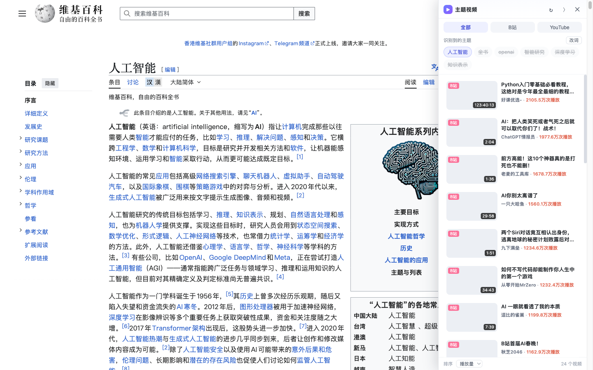

# 主题视频侧栏 · Topic Video Sidebar

一个 Chrome 扩展（Manifest V3）：自动识别当前网页的主题，在页面右侧浮层侧栏中推荐相关的 **哔哩哔哩 / YouTube** 优质视频；支持**订阅博主**，命中主题时**右上角弹窗提醒**，点击即在新标签页打开视频。



## 功能

### 主题视频推荐
- **主题自动识别**：综合页面主标题、`<title>`、meta keywords/og 标签、H1-H3、正文，用中文 n-gram 凝聚分词 + 英文词频/短语统计 + 位置加权，抽取主题关键词（纯本地计算，无外部 AI 依赖）
- **双平台搜索**：
  - B站：调用官方搜索接口，自动完成 **WBI 签名**（无需登录、无需配置）
  - YouTube：填了 Data API Key 走官方 API；不填则自动解析搜索结果页（零配置）
- **优质优先**：默认按播放量排序，多关键词搜不到时自动降级关键词重试
- **交互**：平台切换、排序切换（播放量/相关度/最新）、关键词 chips 点选增删、手动改词、侧栏拖拽调宽、折叠为竖条、`Alt+V` 快捷开关、SPA 路由变化自动重新识别

### 订阅博主 + 主题命中提醒
- **添加博主**：设置页支持 UP主名称 / B站空间链接 / UID，或 YouTube 频道名 / @handle / 频道链接，自动解析真实 UID 与频道 ID
- **推荐组合订阅**：内置 4 组实测博主包，一键整组订阅
  - 数码科技：影视飓风、先看评测、TESTV、极客湾、小白测评、MKBHD、Linus Tech Tips、Dave2D、Mrwhosetheboss
  - AI 科技：稚晖君、林亦LYi、GenJi、通往AGI之路、karpathy、3Blue1Brown、Two Minute Papers、Yannic Kilcher
  - 编程开发：CodeSheep、遇见狂神说、尚硅谷、Fireship、Traversy Media、Net Ninja、freeCodeCamp
  - 知识科普：李永乐老师、妈咪说、星球研究所、中国BOY、Veritasium、Kurzgesagt、Vsauce、Mark Rober
- **右上角弹窗提醒**：侧栏收起/未打开时，只要订阅博主有命中当前页面主题的视频，右上角直接弹出提醒卡片，点击跳转；7 天内不重复打扰（可在设置清除记录）
- **命中逻辑**：B站按「博主名 + 主题」搜索后按作者过滤；YouTube 优先走频道内搜索 API，无 Key 时解析频道 RSS 最新视频做标题关键词匹配；结果缓存 30 分钟

### 其他
- Shadow DOM 隔离样式，不污染页面；本地缓存 5 分钟

## 安装（开发者模式加载）

1. 下载本仓库（`Code` → `Download ZIP` 解压，或 `git clone`）
2. 打开 Chrome，地址栏进入 `chrome://extensions`
3. 右上角打开 **开发者模式**
4. 点击 **加载已解压的扩展程序**，选择 `topic-video-sidebar` 文件夹（manifest.json 所在目录）
5. 打开任意文章/视频/仓库页面，右侧自动弹出侧栏；去扩展弹窗或设置页订阅博主开启提醒

## 使用

### 侧栏
- **点击卡片** → 新标签页打开视频页
- **改词**：主题区 chips 点击可移除/加回关键词，或点「改词」直接输入搜索词回车
- **收起/关闭**：收起后右侧有「主题视频」竖条可再次展开；关闭后点击工具栏扩展图标 → 「在当前页面打开侧栏」
- **快捷键**：`Alt+V` 显示/隐藏

### 订阅与提醒
1. 点击扩展图标 → 「订阅博主 / 提醒设置 / 推荐组合」，或右键扩展图标 → 选项
2. 在「推荐组合订阅」一键订阅整组，或在上方手动添加任意博主
3. 打开提醒开关（默认开启）；当侧栏未展开且订阅博主命中页面主题时，页面右上角会弹出提醒卡片

## 配置（弹窗 / 设置页）

| 选项 | 说明 |
|---|---|
| 默认平台 | B站 + YouTube / 仅 B站 / 仅 YouTube |
| 排序方式 | 播放量（默认）/ 相关度 / 最新 |
| YouTube API Key | 可选。留空用网页解析；填写后结果更稳定且带精确时长、播放量（[申请地址](https://console.cloud.google.com/apis/library/youtube.googleapis.com)） |
| 订阅博主 | 自由添加 / 预设组合一键订阅 |
| 提醒 | 可关闭；可清除提醒记录 |

## 说明与限制

- B站接口为公开 Web 接口 + WBI 签名，无需登录；若遇到风控（412/-352），稍后重试或先在浏览器正常访问一次 bilibili.com
- YouTube 网页解析模式依赖搜索结果页结构，改版可能需更新；追求稳定可填 API Key
- YouTube 无 Key 模式下订阅命中基于频道 RSS 最新 15 条视频的标题匹配
- `chrome://`、Chrome 商店等特殊页面无法注入

## 文件结构

```
topic-video-sidebar/
├── manifest.json     # MV3 配置
├── background.js     # 后台：B站 WBI 签名搜索、YouTube API/网页解析、博主解析、订阅命中检测、缓存
├── content.js        # 内容脚本：主题抽取 + 侧栏 UI + 右上角提醒（Shadow DOM）
├── style.js          # 侧栏与提醒样式
├── presets.js        # 预设订阅包（真实 UID / 频道 ID）
├── options.html/js/css # 订阅管理与设置页
├── popup.html/js/css # 扩展弹窗
└── icons/            # 图标
```

## License

MIT
